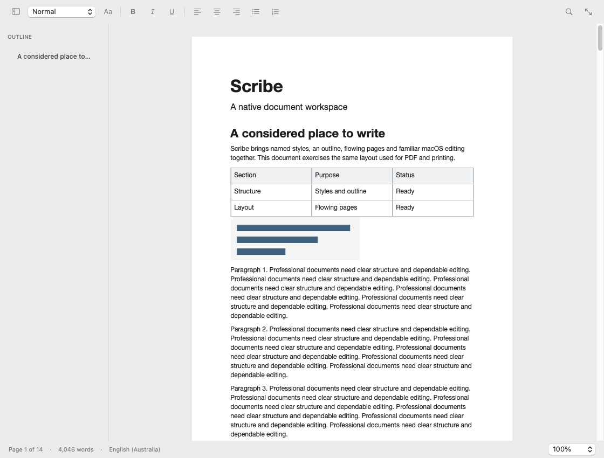

# Scribe

A native document-authoring application for Apple Silicon Macs, built with Swift and AppKit. This repository is an early foundation for a professional word processor, not a finished Word or Pages replacement.

[Download Scribe 0.4.0 for Apple Silicon](https://github.com/Ninnja10563/Scribe/releases/tag/v0.4.0) · [Feature status](docs/FEATURES.md)



[View the dark appearance](docs/images/scribe-dark.png). These are captures of the running macOS application.

Requires **macOS 14+**, an **Apple Silicon Mac**, and **Swift 6** to build.

```sh
swift test
./scripts/build-app.sh
open build/Scribe.app
```

To create a drag-to-Applications installer:

```sh
./scripts/build-dmg.sh
```

On Linux, install Swift 6 plus the zlib development headers (`zlib1g-dev` on Debian/Ubuntu). The document-core and import/export tests can run with `swift test`; the macOS editor is only built and exercised on macOS. No Electron or web runtime is used.

## Current capabilities

- Native multi-window documents and macOS tabs, menus, keyboard shortcuts, spelling and rich text input.
- Shared TextKit storage with real glyph flow across physical pages; A4, Letter, Legal, orientation and margins.
- Named paragraph styles, style modifications, custom styles, headings and outline navigation.
- Common character formatting, font panel, alignment, spacing/indents, basic lists, page breaks, headers/footers and configurable page numbers.
- Structured tables with row/column editing and sizing; inline images with proportional resize handles and accessibility descriptions.
- Find/replace with case and whole-word matching, selected-text word counts, focus mode and zoom.
- Anchored comments with native review controls, multi-paragraph ranges, edit-aware associations, resolution and DOCX interchange.
- Versioned semantic `.scribe` documents, atomic writes, NSDocument autosave and separate recovery snapshots.
- Basic DOCX, RTF, Markdown and UTF-8 text import/export. Imports open as new documents and disclose known fidelity losses.
- Vector-text PDF export and native printing from the editor's glyph layout.

## Scope and limitations

The full requested product is a multi-milestone engineering program. Merged/nested tables, floating objects, shapes, wrapping, track changes, notes, equations, TOC, direct-on-page header editing, and independent section layout are **not implemented**. Bookmark data types and a grammar protocol remain extension points. Anchored comments are implemented.

DOCX supports common text, basic tables, inline images and running content, not full Word interoperability. Merged/nested table geometry, tracked changes, notes and advanced fields are not preserved; comment reply hierarchy and newer collaboration metadata remain limited. Common numbering definitions and restarts are supported; custom compound markers, restart rules and complex styles remain limited, with known losses reported. Markdown supports a small subset and is not a CommonMark round-trip implementation. PDF export supports page ranges and title/author/subject/keywords; image-quality presets are pending; external hyperlinks are retained. Page views are reused but not virtualized. Long-document interactive performance still requires profiling on physical Macs.

See the [feature matrix](docs/FEATURES.md), [architecture and roadmap](docs/DEVELOPMENT.md), [validation](docs/VALIDATION.md), and [installation](docs/INSTALL.md).

## Releases

Pushes run macOS build/test/launch checks. Version tags (`v*`) publish a DMG only after the macOS job succeeds. Development DMGs are ad-hoc signed; Developer ID signing and notarization are not configured. No claim of Microsoft Word or assistive-technology certification is made.

MIT licensed.
